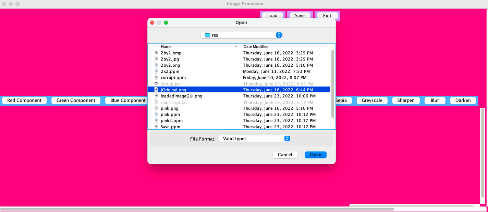
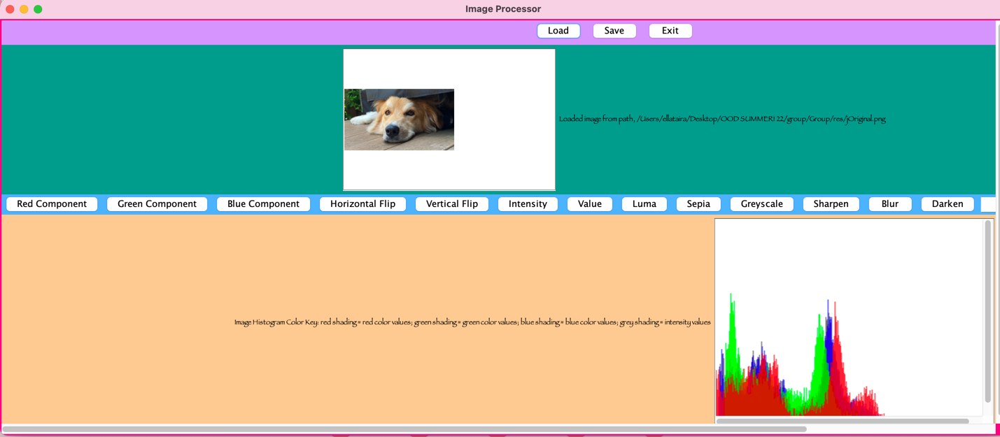
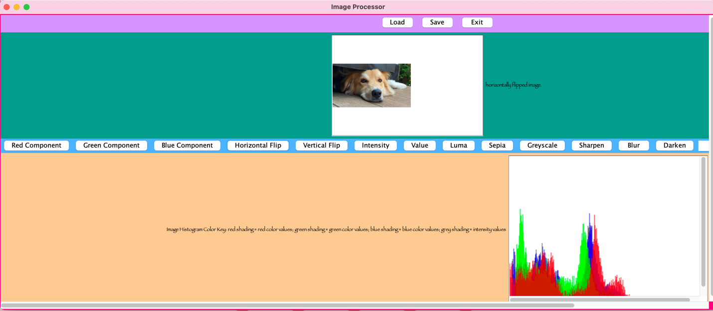
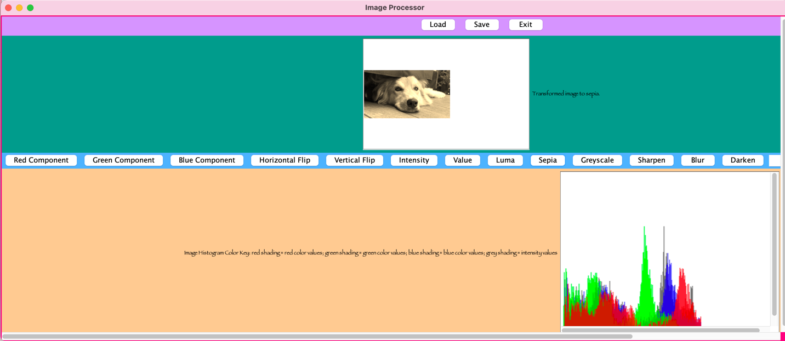
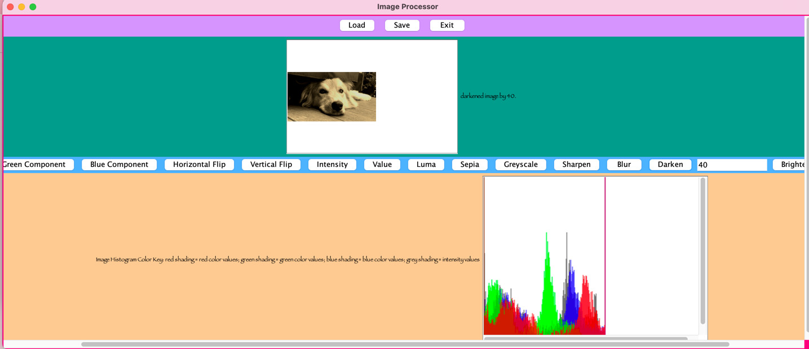
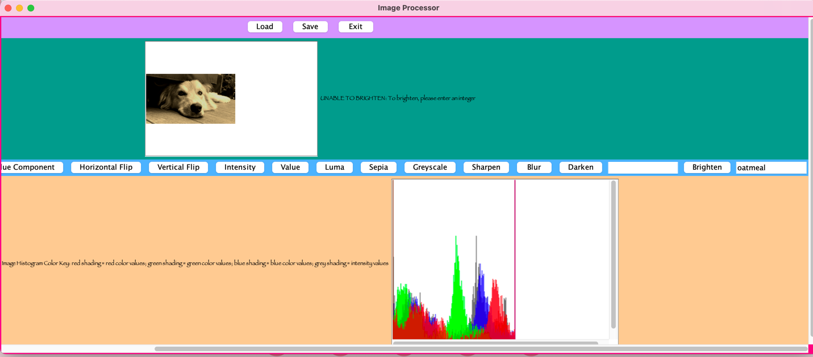
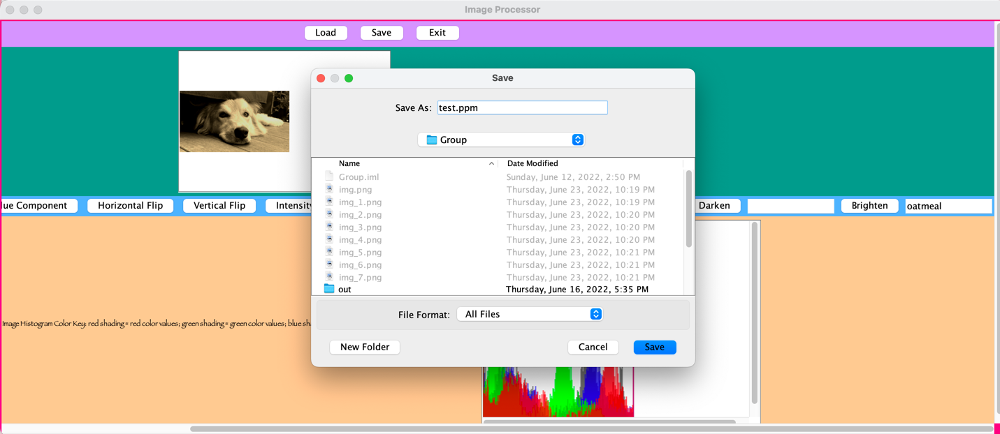

# GUI Instructions

To run the GUI, open terminal at folder, res, and enter, "java -jar Group.jar"

Once the GUI is launched, the user may interact with the present scroll bars to see all facets of the frame. 

### Load 
- Before performing any edits, you must first load an image. 
  - Click the "load" button and select an image from your finder. 

  - The image will appear in the GUI alongside its image histogram. 
    - Next to the image is text feedback that corresponds to the action committed.
    

- You may load a new image at any time. 

### Edit 
- After loading, you will see an array of buttons; each button performs a different edit on the image. 
  - Once you click the button, the edit will be applied to your image. The image displayed will update to reflect the change, as will the image histogram.
    - Again, text feedback will appear next to the image to confirm what was performed. 

#### Buttons: 
The following buttons will perform their named edits as-is when pressed: 
- Red component 
- Green component 
- Blue component 
- Horizontal flip
- Vertical flip 
- Intensity 
- Value 
- Luma 
- Sepia 
- Greyscale 
- Sharpen 
- Blur

**e.g.**

The following buttons require the user to enter an INTEGER before pressing. This integer represents how much the image will be brightened or darkened. If an invalid input is entered when pressing the button, the on-screen feedback will indicate that, and no edit will be performed 
- Darken + [integer]
- Brighten + [integer]

**e.g.** 

To demonstrate the feedback when an improper input is entered alongside brighen:

### Histogram 
- Once the user loads an image, they can view that image's corresponding histogram. 
  - The histogram is updated to reflect each edit. 
  - The text next to the histogram serves as a key for the colors shown. 

### Save
- To save the image currently shown in the frame, press the "save" button. 
  - In finder box that pops up, enter a file name to save the image at, define its location, and press "save". 

### Exit
- To exit the GUI at any time, press "exit."
